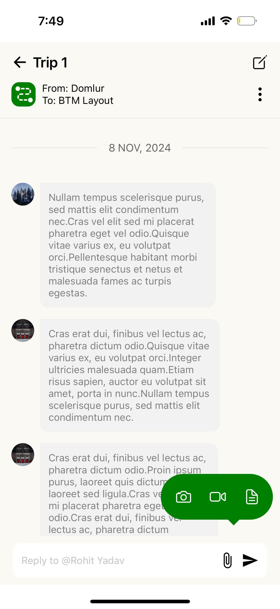
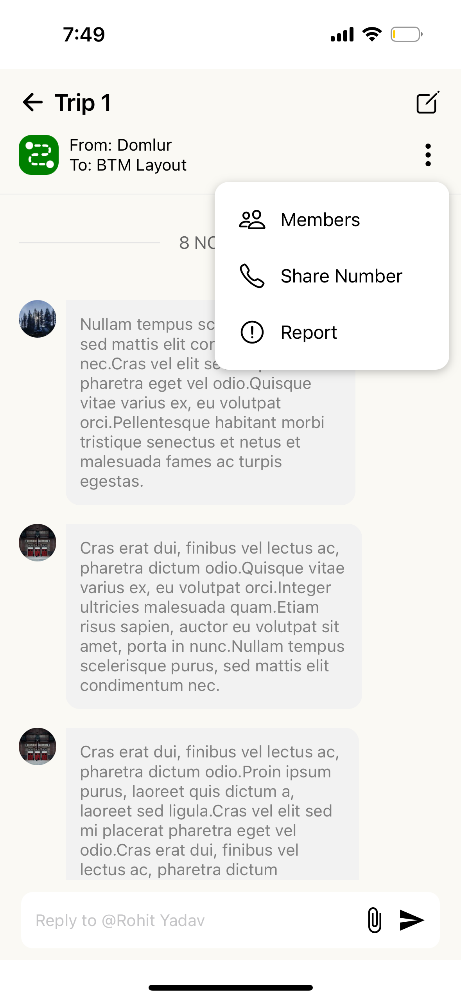
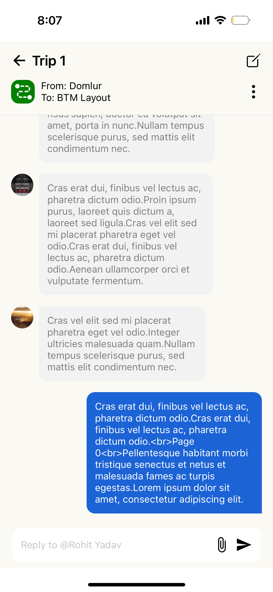

# CoRider-ChatApp

Here's a `README.md` file for your React Native chat application project. This file follows standard conventions, with sections that provide a clear project overview, setup instructions, and a description of key features.

---

# **Hybrid Chat Application**

This is a React Native hybrid chat application that displays real-time chat messages from a server API on both Android and iOS devices. The app loads with the latest messages and allows the user to scroll up to load older messages, with efficient pagination and date separation for an optimal chat experience.

## **Table of Contents**

1. [Project Overview](#project-overview)
2. [Setup Instructions](#setup-instructions)
3. [Project Structure](#project-structure)
4. [Key Components](#key-components)
5. [Data Fetching and Pagination](#data-fetching-and-pagination)
6. [Optimizations](#optimizations)
7. [Screenshots and Walkthrough](#screenshots-and-walkthrough)

---

### **1. Project Overview**

This React Native chat application enables seamless messaging with a user-friendly interface and efficient data loading mechanisms. Key features include:
- Real-time chat display with pagination for older messages
- Date separators for improved readability
- Cross-platform compatibility (iOS and Android)
- Responsive and optimized design

---

### **2. Setup Instructions**

#### **Dependencies**
- **React Native**: Base framework for cross-platform development.
- **Expo**: For rapid development and compatibility with both iOS and Android.
- **Fetch API**: For communication with the backend server.

#### **Setup Steps**

1. Clone the repository:

   ```bash
   git clone <repository-url>
   cd chat-app
   ```

2. Install the dependencies:

   ```bash
   npm install
   ```

3. Start the application in Expo:

   ```bash
   npx create-expo-app ChatApp -t blank 
   cd ChatApp
   npm run ios  # For iOS devices
   npm run android  # For Android devices
   ```

---

### **3. Project Structure**

The project is organized into modular folders for scalability and readability:

```plaintext
/chat-app
├── /assets                     # Static assets for the app
├── /src
│   ├── /components             # Reusable components
│   │   ├── ChatMessage.js      # display messages based on self and other
│   │   ├── ChatHeader.js       # Header component
│   │   ├── ChatInput.js        # Input field for typing messages
│   │   ├── DateSeparator.js    # Date separator for messages
│   ├── /screens
│   │   └── ChatScreen.js       # Main screen for displaying chat messages
│   ├── /api
│   │   └── api.js              # API communication logic
│   └── App.js                  # Root component
└── app.json                    
```

---

### **4. Key Components**

#### **ChatScreen.js**
The main screen of the application where chat messages are displayed. 
#### **ChatHeader.js**
A static header component displaying the chat title and group-related information.

#### **ChatInput.js**
An input field where users can type and submit messages, with submission logic handled internally.

#### **ChatMessage.js**
A component for displaying messages based on the sender/receiver's role.

#### **DateSeparator.js**
Separates messages by date, improving readability and helping users distinguish between different conversation days.

---

### **5. Data Fetching and Pagination**

Messages are fetched from an API using the `fetchChatMessages` function. Pagination is implemented to avoid loading all messages at once. When the user reaches the end of the current messages, the `handleLoadMore` function is triggered, which increases the page number and loads the next set of messages.


### **6. Optimizations**

To ensure efficient data handling, pagination optimization have been implemented:

- **Pagination**: Only a limited number of messages are rendered at a time, reducing memory usage.
- **Initial Load Optimization**: Mocked data is set with `page` defaulting to zero, helping to streamline the initial load.

---

### **7. Screenshots and Walkthrough**

Include screenshots of key components such as the chat header, message list, date separator, and message input area.








For a visual demonstration, refer to the video walkthrough:  
**Video Link**: [https://drive.google.com/file/d/1E0L3NrEJDg5nnWtmE8yqd5jUeMEc2Ap4/view?usp=sharing](#)

---

This README provides a structured overview of the project and setup instructions for developers looking to understand or contribute to the codebase. Additional information, such as testing and future improvements, can be added as the project evolves.
